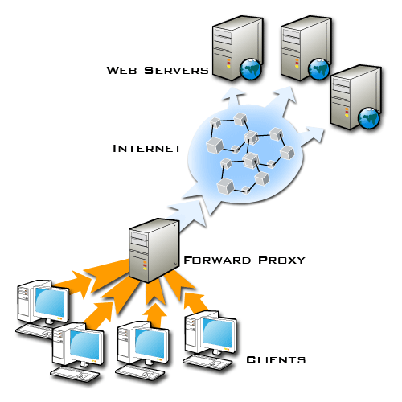

# Reverse Proxy with Nginx
- https://www.youtube.com/watch?v=3yMY5phIaDc&t=497s

## Forward Proxy
- 접속서버의 주소(Proxy 서버의 주소)를 받아서 연결
- 특정 인터넷 사이트의 접속을 차단
- 패킷을 들여다 볼 수 있음



## Reverse Proxy
- 접속서버의 주소를 Porxy 서버가 가지고 있음
- 뒤 서버들을 숨경주는 역활을 함
- 뒤 서버에 서버들을 하나의 접속경로로 묶어준다


## Nginx - HTTP 웹서버
- High Performance HTTP Web Server
- Mail Proxy Server
- TCP/UDP Proxy Server
- Support 3rd party module

## Nginx with Tomcat
- Serving static content by Nginx - css, image, javascript
- Serving dynamic content by Tomcat
- Nginx perform reverse proxy to connect tomcat

## Nginx in Ubuntu 18.04
- Ubuntu 18.04 provide Nginx package
    - Standard Version - gninx-full
    - Basic Version - nginx-light

- Install
    - apt install nginx-light


## Reverse Proxy 설정
- proxy_pass
    - Define backend server which can use HTTP or HTTPS as protocol, domain name or IP Address, optional port and URI
- proxy_set_header
    - It can adjust or set headers
    - Host, X-Real-IP
    - X-Forwarded-For, X-Forwarded-Proto
    - X-Forwarded-Host, X-Forwarded-Port
- proxy_http_version
    - Defines the HTTP Protocol version for proxy
    - Default 1.0
    - If it want high performance, it must set 1.1

## High Performance for Nginx
- 성능을 좋게 하는 설정
```nginx ~ nginx.conf : reverse proxy 구현
location / {
    proxy_pass http://127.0.0.1:8080;
    proxy_http_version 1.1;
    proxy_set_header Connection "";
}
```

## HTTP 1.0 vs HTTP 1.1
- HTTP 1.0
    - immediately close it after the response was sent
    - Required to open up a new connection for each request

- HTTP 1.1
    - Persistent and pipelined connections - keep alive
    - One connection, multiple sent/receive content
    - Compression/Decompression

## Load Balance
> http://nginx.org/en/docs/stream/ngx_stream_upstream_module.html

``` nginx.conf
upstream tomcat {                              
    hash $remote_addr consistent;

    server 127.0.0.1:8080 weight=5;            
    server 127.0.0.1:8081;

    server 127.0.0.1:8100 backup;

    keepalive 10;
}   

server {
    listen              80 default_server;
    listen              [::]:80 default_server;
    server_name         _;

    location / {
                proxy_pass http://tomcat;
                proxy_http_version 1.1;
                proxy_set_header Connection "";

                proxy_set_header Host $host;

                proxy_set_header X-Real-IP $remote_addr;
                proxy_set_header X-Forwarded-For $proxy_add_x_forwarded_for;

                proxy_set_header X-Forwarded-Proto $scheme;
                proxy_set_header X-Forwarded-Host $host;
                proxy_set_header X-Forwarded-Port $server_port;                            
    }
}                              
``` 

``` tomcat ~ server.xml
<Valve className="org.apache.catalina.valves.AccessLogValve" directory="logs"
               prefix="localhost_access_log" suffix=".txt"
               pattern="combined" renameOnRotate="true" requestAttributesEnabled="true" />
```               

## How to deploy contents ~ css, image, javascript
``` nginx ~ nginx.conf
location /static {
    alias /home/systemv/www;
    autoindex off;
    access_log off;
}
```