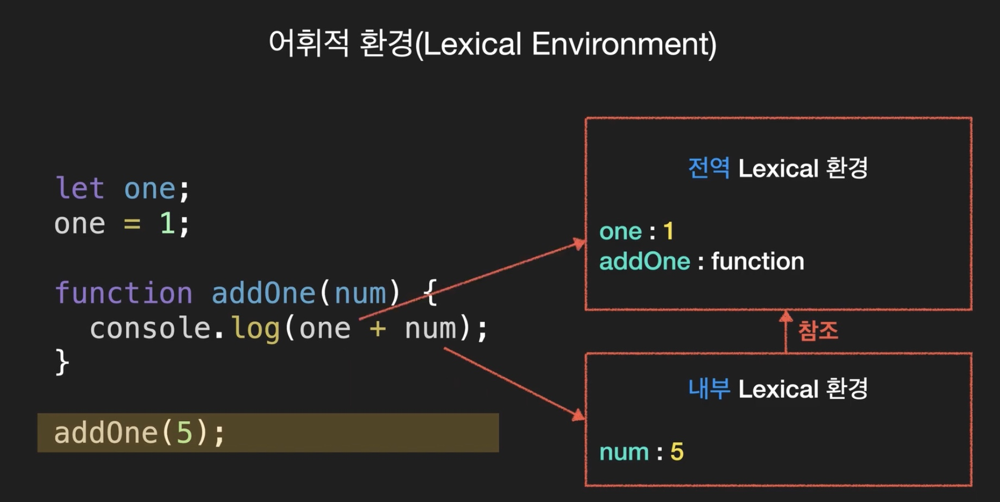
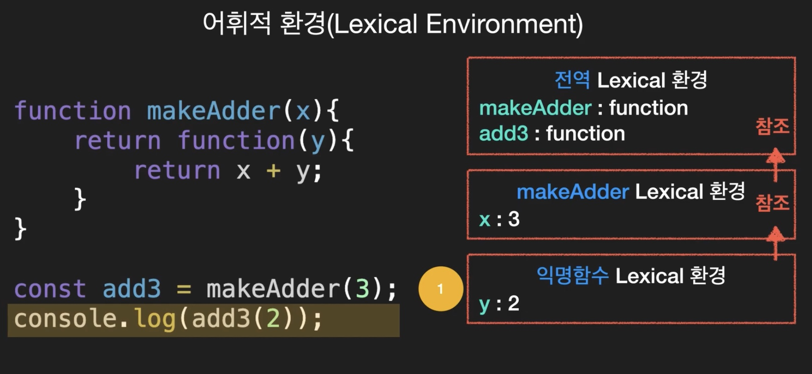

# [코딩앙마] 자바스크립트 중급 강좌

## 1. 변수, 호이스팅, TDZ(Temporal Dead Zone)

### 변수
- let, const ~ ES6에서 신설
- var

### var는 한번 선언된 변수를 다시 선언할 수 있음

- var 변수 선언
```javascript
var name = 'Mike';
console.log(name);  // Mike

var name = 'Jane';  // 두번째 선언
console.log(name);  // Jane 
```

- let 변수 선언
```javascript
let name = 'Mike';
console.log(name);  // Mike

let name = 'Jane';  // 두번째 선언 - 오류 발생
console.log(name);  // Jane 
```

### var는 선언하기 전에 사용할 수 있다.

- 호이스팅(hoisting) : 변수 선언(var name;)만 위로 올림
                    : 스코프 내부 어디서든 변수 선언은 최상위에 선언된 것 처럼 행동
```javascript
console.log(name);  // undefined : 선언은 호이스팅 되지만 값은 호이스팅 되지 않음. 오류는 발생하지 않음
var name = 'Mike';
```

```javascript
console.log(name);  // undefined
var name = 'Mike';
```

- let 
```javascript
console.log(name);  // ReferenceError 
let name = 'Mike';
```

#### let 은 var와 같이 호이스팅 됮만 왜 에러가 날까/
- Temporal Dead Zone(TDZ)
    - TDZ 영역에 있는 변수들은 사용할 수 없다.
    - let 과 const는 TDZ의 영향을 받음. 할당을 하기전에 사용할 수 없음

- 호이스팅 관련 에러 발생 주의(많은 개발자가 착각 함)
    - 호이스팅은 스코프 내에서 발생 함. let도 호이스팅 발생

```javascript
let age = 30;

function showAge() {
    console.log(age);   // 오류 발생
    let age = 20;   
}
```

- 위 코드는 아래처럼 호이스팅 됨
```javascript
let age = 30;

function showAge() {
    let age;                // 호이스팅 됨
    console.log(age);       // 오류 발생
    let age = 20;   
}
```


### 변수의 생성 과정
1. 선언단계
2. 초기화 단계
3. 할당 단계

- var
    - 1단계 : 선언 및 초기화 단계가 동시에 발생 ~ 초기화는 undefined를 할당하는 단계
    - 2단계 : 할당 단계

- let
    - 1단계 : 선언단계
    - 2단계 : 초기화 단계
    - 3단계 : 할당 단계

- const
    - 1단계 : 선언 + 초기화 + 할당

```javascript
 let name;
 name = 'Mike';

 var age;
 age = 30;

 const gender;      // 오류 발생
 gender = 'male';
```

### 스코프(Scope)
- var : 함수 스코프(function-scoped) - 함수 내에서 선언된 변수만 지역변수가 됨
- let, const : 블록 스코프(block-scoped)
    - 블록 스코프 : 함수, if문, for문, while문, try/catch문 등
        - function add() { // Block-level Scope }, if() { // Block-level Scope }, for() { // Block-level Scope }

- var Scope
```javascript
const age = 30;

if(age>19) {
    var txt = '성인';
}
console.log(txt);   // 성인
```

- var 함수 스코프
```javascript
function add(num1, num2) {
    var result = num1 + num2;
}
add(2,3);
console.log(result);    // 오류 발생
```


## 2. 생성자 함수

### 객체 리터럴
```javascript
let user = {
    name: 'Mike',
    age: 30,
}
```

### 생성자 함수

```javascript
function User(name, age) {
    this.name = name;
    this.age = age;
}

let user1 = new User('Mike', 30);
let user2 = new User('Jane', 22);
let user3 = new User('Tom', 17);
```

- 생성자 method 추가
```javascript
function User(name, age) {
    this.name = name;
    this.age = age;
    this.sayName = function() {
        console.log(this.name);
    }
}

let user5 = new User('Han', 40);
user5.sayName();
```


## 3. 객체 메소드(Object methods), 계산된 프로퍼티(Computed property)

### Computed property
```javascript
let a = 'age';
const user = {
    name: 'Mike';
    [a]: 30     // age: 30, [a]는 a변수의 값을 의미, [a]를 computed property(계산된 프로퍼티라고 함)
}
```

```javascript
const user = {
    [1+4]: 5,
    ['안녕'+'하세요']: 'Hello',
}
user   // {5:5, 안녕하세요:'Hello'}
```

### 객체에서 사용할 수 있는 메소드
- Object.assign()   // 객체를 복사할 수 있음. 객체 복사
    - const newUser = Object.assign({}, user);
```javascript
const user = {
    name: 'Mike',
}

const info1 = {
    age: 30,
}

const info2 = {
    gender: 'male',
}

Object.assign(user, info1, info2);
```

- Object.keys()     // 키 배열 반환
```javascript
const user = {
    name: 'Mike',
    age: 30,
    gender: 'male',
}
Object.keys(user);      // ['name', 'age', 'gender']
```

- Object.values()       // 값 배열 반환
```javascript
const user = {
    name: 'Mike',
    age: 30,
    gender: 'male',
}
Object.values(user);      // ['Mike', 30, 'male']
```

- Object.entries()      // 키/값 배열 반환
```javascript
const user = {
    name: 'Mike',
    age: 30,
    gender: 'male',
}
Object.entries(user);      // [['name', 'Mike'], ['age', 30], ['gender', 'male']]
```

- Object.fromEntries()  // 키/값 배열을 객체로 변환
```javascript
const arr = 
[
    ['name', 'Mike'],
    ['age', 30],
    ['gender', 'male'],
]
Object.fromEntries(arr);      // { name: 'Mike', age: 30, gender: 'male' }
```


## 3. 심볼(Symbol)

- property key : 문자형
```javascript
const obj = {
    1: '1입니다',
    false: '거짓',
}
Object.keys(obj);   // ['1', 'false']
obj['1];
obj['false'];
```

#### Symbol
```javascript
const a = Symbol(); // new를 붙이지 않음. Symbol()은 유일한 식별자를 만들 때 사용
const b = Symbol();

console.log(a);     // Symbol()
console.log(b);     // Symbol()

console.log(a === b)    // false
```

#### Symbol : 유일성 보장
```javascript
const id = Symbol('id');
const id2 = Symbol('id');

id  // Symbol(id)
id2 // Symbol(id)'
id === id2  // false
id == id2   // false
```

#### property key : 심볼형
```javascript
const id = Symbol('id');
const user = {
    name: 'Mike',
    age: 30,
    [id]: 'myid',
}

console.log(user);      // { name: 'Mike', age: 30, Symbol(id): 'myid' }
user[id]    // 'myid'
Object.keys(user);      // ['name','age'], [id] 를 건너 뛰움.
Object.values(user);    // ['Mike', 30], [id] 를 건너 뛰움.
Object.entries(user);   // [Array(2), Array(2)], [id] 를 건너 뛰움.
for(let a in user) {};  // [id] 를 건너 뛰움.
```
#### 이러한 Symbol의 특성을 어디에 사용할까?
- 원본 객체를 변경하지 않고 나만의 속성을 추가할 때 사용


#### Symbol.for() : 전역 심볼
- 하나의 심볼만 보장받을 수 있음
- 없으면 만들고, 있으면 가져오기 때문

- Symbol 함수는 매번 다른 Symbol 값을 생성하지만
- Symbol.for 메소드는 하나를 생성한 뒤 키를 통해 같은 Symbol을 공유

- (예) 
```javascript
const id1 = Symbol.for('id');
const id2 = Symbol.for('id');
console.log(id1 === id2);       // true

Symbol.keyFor(id1);             // 'id'
```

- 전역 심볼이 아닌 심볼은 전역심볼을 사용할 수 없음
```javascript
const id = Symbol.for('id 입니다.');
id.description;                 // 'id 입니다.'
```

#### 숨겨진 Symbol key 보는 법
```javascript
const id = Symbol('id');

const user = {
    name: 'Mike',
    age: 30,
    [id]: 'myid',
}

Object.getOwnPropertySymbols(user);     // [Symbol(id)]

Reflect.ownKeys(user);                  // ['name', 'age', Symbol(id)], 전체를 다 보여줌
```


## 5. 숫자(Number), 수학(Math) Method

### toString()

- 10진수 -> 2진수/16진수

```javascript
let num = 10;
num.toString();         // '10'
num.toString(2);        // '1010'

let num2 = 255; 
num2.toString(16);      // 'FF'  
```

### Math - 수학과 관련된 property와 메소드를 가지고 있음

```javascript
Math.PI;                // 3.141592 ......
```

#### math.ceil() : 올림
```javascript
let num1 = 5.1;
let num2 = 5.7;

Math.ceil(num1);    // 6
Math.ceil(num2);    // 6
```

#### math.floor() : 내림
```javascript
let num1 = 5.1;
let num2 = 5.7;

Math.floor(num1);    // 5
Math.floor(num2);    // 5
```

#### math.round() : 반올림
```javascript
let num1 = 5.1;
let num2 = 5.7;

Math.ceil(num1);    // 5
Math.ceil(num2);    // 6
```

#### 소수점 자릿수
- 요구사항 : 소수점 둘쨰자리까지 표현(셋째 자리에서 반올림)
```javascript
let userRate = 30.1234;

Math.round(userRate * 100) / 100;    // 30.1234 * 100 = Math.round(3012.44) = 3012 / 100 = 30.12
```

#### 소수점 자릿수 : toFixed() - 문자열 반환
- 요구사항 : 소수점 둘쨰자리까지 표현(셋째 자리에서 반올림)
```javascript
let userRate = 30.1234;

userRate.toFixed(2);                // '30.12'

userRate.toFixed(0);                // '30'
userRate.toFixed(6);                // '30.123400' - 0으로 채워 줌

// 문자로 반환되므로 Number()를 이용하여 숫자로 변환
Number(userRate.toFixed(2));        // 30.12
```

#### isNaN()
```javascript
let x = Number('x');        // NaN

// NaN의 특징
x == NaN        // false
x === NaN       // false
NaN == NaN      // false, 특이함

isNaN(x)        // true
isNaN(3)        // false
```

#### parseInt() - 문자열을 숫자로 변경, 문자가 혼용되어 있어도 숫자로 변환 가능(단, 숫자로 시작해야 함.)
```javascript
let margin = '10px'

parseInt(margin);       // 10
Number(margin);         // NaN

let redColor = 'f3';
parseInt(redColor);       // NaN

// 문자이지만 16진수 형이면 16진수로 변경 가능
let redColor = 'f3';
parseInt(redColor, 16);     // 243 - 16진수 F3d을 십진수 243으로 변환하여 리턴

parseInt('11', 2);          // 3
```

#### parseFloat()
```javascript
let padding = '18.5%';

parseInt(padding);      // 18
parseFloat(padding);    // 18.5
```

#### Math.random() - 0 ~ 1 사이 무작위 숫자(실수) 생성
```javascript
Math.random();      // 0.2602 ...
Math.random();      // 0.6302 ...
Math.random();      // 0.5452 ...
Math.random();      // 0.7782 ...

// 1 ~ 100 사이 임의의 숫자를 뽑고 싶다면?
Math.floor(Math.random() * 100) + 1;
```

#### Math.max() / Math.min()
```javascript
Math.max(1, 4, -1, 5, 10, 9, 5.54); // 10
Math.min(1, 4, -1, 5, 10, 9, 5.54); // -1
```

#### Math.abs() - absolute
```javascript
Math.abs(-1); // 1
```

#### Math.pow(n, m) - 거듭제공
```javascript
Math.pow(2, 10); // 1024
```

#### Math.sqrt() - 제곱근(squre root)
```javascript
Math.sqrt(16);       // 4
```


## 6. String

### ', ", `(백틱)

### 백틱(`)의 유용한 기능 - 여러줄
```javascript
let desc = `fdfdfdfdf
dfdfdfdf
dfdfdfd.`;
```


### length : 문자열 길이

```javascript
let desc = '안녕하세요.';
desc.length;        // 6
```


### 특정 위치에 접근 - 배열처럼 해당 인텍스의 문자를 변경할 수 는 없음

```javascript
let desc = '안녕하세요.';
desc[2];            // '하'
```


### toUpperCase() / toLowerCase()

```javascript
let desc = 'Hi';

desc.toUpperCase();     // 'HI'

desc.toLowerCase();     // 'hi'
```


### str.indexOf(text) - 해당 문자가 존재하면 해당 문자의 시작 index를 알려줌

```javascript
let desc = 'Hi guys. Nice to meet your.';

desc.indexOf('to');     // 14
desc.indexOf('man');    // -1 ~ 찾는 문자가 없으면 -1 반환

// 주의 사항 - 안 찍힘 desc.indexOf('Hi') 가 0으로 반환되고 0은 false를 의미하므로
// if(desc.indexOf('Hi')) {      // 오류 코드
if(desc.indexOf('Hi') > -1) {    // 정상 코드
    console.log('abc';)
}
```


### str.slice(n, m)) - 특정 문자열 추출. n은 시작점, m은 없으면 끝까지, 양수면 그 숫자까지(포함하지 않음), 음수면 끝에서 부터 셈

```javascript
let desc = 'abcdefg';
desc.slice(2);      // 'cdefg'
desc.slice(0,5);    // 'abcd'
desc.slice(2, -2);  // 'cdef'
```


### str.substring(n, m)) - n과 m의 이전 문자열 반환. n과 m을 바꿔도 동작함. 음수는 0으로 인식

```javascript
let desc = 'abcdefg';
desc.substring(2, 5);       // 'cde'
desc.substring(5, 2);       // 'cde'
```


### str.trim() - 앞 뒤 공백 제거

```javascript
let desc = '  coding      ';
desc.trim();       // 'coding'
```


### str.repeat(n) - n번 반복

```javascript
let hello = 'hello!';
hello.repeat(3);       // 'hello!hello!hello!'
```


### 문자열 비교

```javascript
1 < 3       // true
'a' < 'c'   // true

// 아스키 코드 가져오기
'a'.codePointAt(0);             // 97
String.fromCodePoint(97);       // 'a'


let hello = 'hello!';
hello.repeat(3);       // 'hello!hello!hello!'
```


## 7. 배열(Array)

### 배열 기본 메서드
- push() : 뒤에 삽입
- pop() : 뒤에 삭제
- unshift() : 앞에 삽입
- shift() - 앞에 삭제

### arr.splice(n, m) - 특정 요소 지움. n번째 시작 m개의 갯수
```javascript
let arr = [1,2,3,4,5];
arr.splice(1, 2);
console.log(arr);       // [1, 4, 5]

// arr.splice(n, m, x) : 특정 요소 지우고 추가, x에 추가할 요소들을 기재
let arr = [1,2,3,4,5];
arr.splice(1, 3, 100, 200);
console.log(arr);       // [1, 100, 200, 5]

let arr = ['나는', '철수', '입니다'];
arr.splice(1, 0, '대한민국', '소방관');     // ['나는', '대한민국', '소방관, '철수', '입니다']
```

### arr.splice() : 삭제된 요소 반환
```javascript
let arr = [1,2,3,4,5];
let result = arr.splice(1, 2);
console.log(arr);       // [1, 4, 5]
console.log(result);       // [2, 3]
```

### arr.slice(n, m) : n부터 m-1까지 반환, m을 사용하지 않으면 끝까지
```javascript
let arr = [1,2,3,4,5];
arr.slice(1, 4);        // [2, 3, 4]

let arr2 = arr.slice();
console.log(arr2);       // [1,2,3,4,5]
```

### arr.concat(arr2, arr3 ...) : 합쳐서 새배열 반환
```javascript
let arr = [1, 2];
arr.concat([3, 4]);     // [1, 2, 3, 4] 

arr.concat([3, 4], [ 5, 6]);    // [1, 2, 3, 4, 5, 6]
arr.concat([3, 4], 5, 6);       // [1, 2, 3, 4, 5, 6] 
```


### arr.forEach(fn) : 배열 반복
```javascript
let users = ['Mike', 'Tom', 'Jane'];
users.forEach((item, index, arr) => {   // 첫번째와 두번째 매개변수를 많이 사용 함
    ...
});
```


### arr.indexOf / arr.lastIndexOf
```javascript
let arr = [1,2,3,4,5,1,2,3];
arr.indexOf(3);     // 2
arr.indexOf(3, 3);  // 7 - 인텍스 3부터 시작해서 나오는 3의 index

arr.latIndexOf(3);  // 7 - 뒤에서부터 3의 인덱스를 반환
```


### arr.includes() - 포함하는 지 여부
```javascript
let arr = [1,2,3];
arr.includes(2);    // true
arr.includes(8);    // false
```


### arr.find(fn) / arr.findindex(fn) - 첫번째 true 값만 반환하고 끝. 만약 없으면 undefined 를 반환
```javascript
let arr = [1,2,3,4,5];
const result = arr.find((item) => {
    return item % 2 === 0;  
});

console.log(result)
```


### arr.filter(fn) - 만족하는 모든 요소를 반환
```javascript
let arr = [1,2,3,4,5,6];

const result = arr.filter((item) => {
    return item % 2 === 0;  
});

console.log(result);        // [2, 4, 6]
```


### arr.reverse() : 역순으로 재정렬
```javascript
let arr = [1,2,3,4,5];
arr.reverse();      // [5,4,3,2,1]
```


### arr.map(fn) - 함수를 받아 특정 기능을 수행하고 새로운 배열을 반환
```javascript
let userList = [
    {name: 'Mike', age: 30},
    {name: 'Jane', age: 27},
    {name: 'Tom', age: 10},
];

let newUserList = userList.map((user, index) => {
    return Object.assign({}, user, {
        isAdult: user.age > 19, 
    });
});

console.log(newUserList);
```


### join(), split()

// join() - 배열을 문자열로 변환

```javascript
let arr = ['안녕', '나는', '철수야'];

let result = arr.join();     // 안녕, 나는, 철수야 - 인수를 생략하면 ','로 구분
let result = arr.join(' ');
let result = arr.join('-');


// split() - 문자열을 배열로 변환

const users = 'Mike, Jane, Tom, Tony';
const result = users.split(',');
console.log(result);        // ['Mike', 'Jane', 'Tom', 'Tony']

const str = 'Hello, My name is Mike.';
const result = str.split('');
console.log(result);        // ['H','e','l','l', ...]
```

### Array.isArray()
```javascript
let user = {
    name: 'Mike',
    age: 30,
};

let userList = ['Mike', 'Tom', 'Jane'];

console.log(typeof user);       // object
console.log(typeof userList);   // object

console.log(Array.isArray(user));   // false
console.log(Array.isArray(userList));   // true
```


## 8. 배열 메소드(sort, reduce)

### arr.sort() - 배열 재정렬, 배열 자체가 변경되니 주의, (주의) 숫자라 하더라도 문자열 기준으로 정렬됨
```javascript
let arr = [1, 5, 4, 2, 3];
arr.sort();
console.log(arr);       // [1, 2, 3, 4, 5]

let arr = ['a', 'c', 'b', 'd'];
arr.sort();
console.log(arr);       // ['a','b','c','d']

// 숫자를 문자열 타입으로 소트 함
let arr = [27, 8, 5, 13];
arr.sort();
console.log(arr);       // [13, 27, 5, 8]

// 숫자를 소트하는 방법 - sort(fn)
let arr = [27, 8, 5, 13];

arr.sort((a, b) => {
    return a - b;
});
```

// Lodash 와 같은 유틸리티를 사용함 - 실무에서 많이 사용함
/// https:/lodash.com

_.sortBy(arr);


### arr.reduce() - 인수로 함수를 받음 : (누적계산값, 현재값) => { return 계산값 };
```javascript
// 배열의 모든수 합치기
// for, for of, forEach

// forEach()
let arr = [1,2,3,4,5];

let result = 0;
arr.forEach(num => {
    result += num;
})

console.log(result);

// recude(fn, 초기값) 사용
const result1 = arr.reduce((prev, cur) => {
    return prev + cur;
}, 0);

console.log(result1);

// 객체에서의 reduce() 사용
let userList = [
    { name: 'Mike', age: 30 },
    { name: 'Tom', age: 10 },
    { name: 'Jane', age: 27 },
    { name: 'Sue', age: 26 },
    { name: 'Harry', age: 42 },
    { name: 'Steve', age: 60 },
];

let result = userList.reduce((prev, cur) => {
    if(cur.age > 19) {
        prev.push(cur.name);
    }
    return prev;
}, []);

console.log(result);


// 나이의 합
let result = userList.reduce((prev, cur) => {
    prev += cur.age;
    return prev;
}, 0);

console.log(result);


// 이름이 3자인 사람
let result = userList.reduce((prev, cur) => {
    if(cur.name.length === 3) {
        return prev.push(cur.name);
    }
}, []);

console.log(result);
```


### arr.reduceRight() - 우측부터 수행. 인수로 함수를 받음 : (누적계산값, 현재값) => { return 계산값 };
- arr.reduce() 와 동일


## 9. 구조 분해 할당(Destructuring assignment)
- 구조 분해 할당 구문은 배열이나 객체의 속성을 분해해서 그 값을 변수에 담을 수 있게 하는 표현식

### 배열 구조 분해
```javascript
let [x, y] = [1, 2];
console.log(x);     // 1
console.log(y);     // 2

let users = ['Mike', 'Tom', 'Jane'];

let user1 = users[0];
let user2 = users[1];
let user3 = users[2];

let [user1, user2, user3] = users;  // 위의 할당문과 동일

console.log(user1);     // 'Mike'
console.log(user2);     // 'Tom'
console.log(user3);     // 'Jane'

// split() 을 이용한 방법

let str = 'Mike-Tom-Jane';
let [user1, user2, user3] = str.split('-');
console.log(user1);     // 'Mike'
console.log(user2);     // 'Tom'
console.log(user3);     // 'Jane'
```

#### 배열 구조 분해 : 기본값

```javascript
let [a, b, c] = [1, 2]; // c 에는 undefined 할당

// 기본값 할당
let [a=3, b=4, c=5] = [1, 2]
console.log(a);     // 1
console.log(b);     // 2
console.log(c);     // 5
```


#### 배열 구조 분해 : 일부 반환값 무시

```javascript
let [user1, , user2] = ['Mike', 'Tom', 'Jane', 'Tony'];
console.log(user1);     // 'Mike'
console.log(user2);     // 'Jane'
```


#### 배열 구조 분해 : 바꿔치기

[a, b] = [b, a];


### 객체 구조 분해

```javascript
let user = {name: 'Mike', age: 30};

let name = user.name;
let age = user.age;

let {name, age} = user;     // 위의 할당문과 같음
let {age, name} = user;     // 순서를 바꾸어도 상관없음
let {name: username, age: userAge} = user;  // 변수 이름을 바꾸어서 핳당

console.log(name);      // 'Mike'
console.log(age);       // 30
```

#### 객체 구조 분해 : 기본값
```javascript
let user = {name: 'Mike', age: 30};
let {name, age, gender} = user;     // gender는 undefined 할당됨

// 기본값 할당
let {name, age, gender='male'} = user;

let user = {
    name: 'Jane',
    age: 18,
    gender: 'female',
}

let {name, age, gender = 'male'} = user;
console.log(gender);        // 'female'
```


## 10. 나머지 매개변수, 전개 구문(Rest parameters, Spread syntax)

### 나머지 매개변수(Rest parameters) : ...

#### 인수 전달
```javascript
function showName(name) {
    console.log(name);
}
showName('Mike');
showName('Mike', 'Tom');    // 오류 나지 않음. 여러개 인수를 넣어도 됨. 없어도 됨
showName();                 // undefined

// 함수의 인수를 받는 방법 2가지 : arguments, 나머지 매개변수
/// 화살표 함수에는 arguments 가 없음
```

#### arguments
- 함수로 넘오 온 모든 인수에 접근
- 함수내에서 이용 가능한 지역 변수
- length / index
- Array 형태의 객체
- 배열의 내장 메서드 없음(forEach, map)
- ES6 환경에서는 arguments 보다는 Rest parameters 방식을 권고 함.

```javascript
function showName(name) {
    console.log(arguments.length);
    console.log(arguments[0]);
    console.log(arguments[1]);
}

showName('Mike', 'Tom');
// 2
// 'Mike'
// 'Tom'

```

#### 나머지 매개변수(Rest parameters)
- 배열의 메소드 사용 가능(forEach, reduce(), ...)

```javascript
function showName(...names) {
    console.log(names);
}
showName();                 // []
showName('Mike');           // ['Mike']
showName('Mike', 'Tom');    // ['Mike', 'Tom']
```

// 전달 받은 모든 수를 더해야 함 - Rest parameters + forEach()
```javascript
function add(...numbers) {
    let result = 0;
    numbers.forEach((num) => {
        result += num;
    });
    return result;
}

add(1,2,3);
add(1,2,3,4,5,6,7,8,9,10);
```

// 전달 받은 모든 수를 더해야 함 - Rest parameters + reduce()
```javascript
function add(...numbers) {
    numbers.reduce((prev, cur) => {
        prev += cur;
    }, 0);
    console.log(prev);
    return prev;
}

add(1,2,3);
add(1,2,3,4,5,6,7,8,9,10);
```

// 나머지 매개변수를 이용하여
// user 객체를 만들어 주는 생성자 함수를 만들어 봅시다
// 나머지 매개변수는 마지막에 위치해야 함

```javascript
function User(name, age, ...skills) {
    this.name = name;
    this.age = age;
    this.skills = skills
}

const user1 = new User('Mike', 30, 'html','css');
const user2 = new User('Tom', 20, 'JS','React');
const user3 = new User('Jane', 10, 'English');

console.log(user1);
console.log(user2);
console.log(user3);
```


#### 전개구문(Spread syntax) : 배열
```javascript
let arr1 = [1,2,3];
let arr2 = [4,5,6];

let result = [...arr1, ...arr2];
console.log(result);        // [1,2,3,4,5,6]

let result = [0, ...arr1, ...arr2, 7,8,9];
console.log(result);        // [0,1,2,3,4,5,6,7,8,9]

// 배열의 전개구문을 코딩하려면 arr.push(), arr.splice(), arr.concat() 등의 함수를 복잡하게 조합해야 함
```


#### 전개구문(Spread syntax) : 객체

```javascript
let uesr = {name: 'Mike'}
let mike = {...user, age: 30}

console.log(mike);      // {name: 'Mike', age: 30}
```


#### 전개구문(Spread syntax) : 복제
```javascript
let arr = [1, 2, 3];
let arr2 = [...arr];        // [1,2,3]

let user = {name: 'Mike', age: 30};
let user2 = {...user};      

user2.name = 'Tom';
console.log(user.name);     // 'Mike'
console.log(user2.name);     // 'Tom'
```

## 11. 클로저(Closure)
- 함수와 렉시컬 환경의 조합
- 함수가 생성될 당시의 외부 변수를 기억
- 생성 이후에도 계속 접근 가능

### 어휘적 환경(Lexical Environment) - 자바스크립트는 어휘적 환경을 같는다
```javascript
let one;
one = 1;

function addOne(num) {
    console.log(one + num);
}
addOne(5);
```
</img>   

```javascript
function makeAdder(x) {
    return function(y) {
        return x + y;
    }
}

const add3 = makeAddr(3);
console.log(add3(2));
```

</img>   

```javascript
function makeCounter() {
    let num = 0;        // 은닉화

    return function() {
        return num++;
    };
}

let counter = makeCounter();
console.log(counter());     // 0
console.log(counter());     // 1
console.log(counter());     // 2
```

## 12. setTimeout / setInterval
- setTimeout - 일정 시간이 지난 후 함수를 실행
- setInterval - 일정 시간 간격으로 함수를 반복

### setTimeout - 일정 시간이 지난 후 함수를 실행
```javascript
function fn() {
    console.log(3);
}
setTimeout(fn, 3000);   // (실행할 fn, milliseconds)
```

```javascript
setTimeout(function() {console.log(3);}, 3000);   // (실행할 fn, milliseconds)
```

// function에 인수가 필요한 경우
```javascript
function showName(name) {
    console.log(name);
}

setTimeout(showName, 3000, 'Mike');
```
### setTimeout의 스케쥴 취소
```javascript
function showName(name) {
    console.log(name);
}

const tId = setTimeout(showName, 3000, 'Mike');
clearTimeout(tId);
```

### setTimeout delay=0 ?
```javascript
setTimeout(function() {
    console.log(2);
}, 0);
console.log(1);     // 1, 2
```

### setInterval - 일정 시간 간격으로 함수를 반복 수행
```javascript
function showName(name) {
    console.log(name);
}

const tId = setInterval(showName, 3000, 'Mike');
```
- 반복수행 취소
```javascript
function showName(name) {
    console.log(name);
}

const tId = setInterval(showName, 3000, 'Mike');
clearInterval(tId);
```


## 13. call, apply, bind
- 자바스크립트에서는 함수 호출 방식과 관계없이 this를 지정할 수 있음

### call 메서드
- 모든 함수에서 사용할 수 있으며, this를 특정값으로 지정할 수 있음

```javascript
const mike = {
    name: 'Mike',
};

const tom = {
    name: 'Tom',
};

function showThisName() {
    console.log(this.name);
}

showThisName(); // undefined. this 는 Window를 가리키며 Window.name = undefined
showThisName.call(mike);
showThisName.call(tom);


function update(birthYear, occupation) {
    this.birthYear = birthYear;
    this.occupation = occupation;
};

update.call(mike, 1999, 'singer');
console.log(mike);
```

### apply 메서드
- apply는 함수 매개변수를 처리하는 방법을 제외하면 call과 안전히 같음
- call은 일반적인 함수와 마찬가지로 매개변수를 직접 받지만, apply는 매개변수를 배열로 받음

```javascript
const mike = {
    name: 'Mike',
};

const tom = {
    name: 'Tom',
};

function showThisName() {
    console.log(this.name);
}

function update(birthYear, occupation) {
    this.birthYear = birthYear;
    this.occupation = occupation;
};

update.apply(mike, [1999, 'singer']);
console.log(mike);

update.apply(tom, [2002, 'teacher']);
console.log(tom);
```

```javascript
const minNum = Math.min(3, 10, 1, 6, 4);
const maxNum = Math.max(3, 10, 1, 6, 4);

console.log(minNum);
console.log(maxNum);

// Spread 연산자
nums = [3, 10, 1, 6, 4]
const minNum1 = Math.min(...nums);
const maxNum1 = Math.max(...nums);

console.log(minNum1);
console.log(maxNum1);

// apply
const minNum2 = Math.min.apply(null, nums);
const maxNum2 = Math.max.apply(null, nums);

console.log(minNum2);
console.log(maxNum2);

// call
const minNum3 = Math.min.apply(null, ...nums);
const maxNum3 = Math.max.apply(null, ...nums);

console.log(minNum3);
console.log(maxNum3);
```

### bind 메서드
- 함수의 this 값을 영구히 바꿀 수 있음

```javascript
const mike = {
    name: 'Mike',
};

function update(birthYear, occupation) {
    this.birthYear = birthYear;
    this.occupation = occupation;
};

const updateMike = update.bind(mike);
updateMike(1980, 'police');
console.log(mike);
```

```javascript
const user = {
    name: 'Mike',
    showName: function() {
        console.log(`Hello, ${this.name}`);
    },
};

user.showName();

let fn = user.showName;
fn();

fn.call(user);
fn.apply(user);

let boundFn = fn.bind(user);
boundFn();
```


## 14. 상속, prototype
```javascript
const user = {
    name: 'Mike',
}

console.log(user.name);
console.log(user.hasOwnProperty('name'));
console.log(user.hasOwnProperty('age'));

console.log(user);

// prototype 을 알기위해 상속 이용
const Car = {
    wheels: 4,
    drive() {
        console.log(`drive ... ${this.name}`)
    },
};

const bmw = {
    color: 'red',
    navigation: 1,
};

const benz = {
    color: 'black',
};

const audi = {
    color: 'blue',
};

bmw.__proto__ = Car;
benz.__proto__ = Car;
audi.__proto__ = Car;

const x5 = {
    color: 'white',
    name: 'x5',
}

x5.__proto__ = bmw; // prototype chain

benz.drive();
console.log(x5.name);
console.log(x5.navigation);
x5.drive();

console.log('-----------------------------');
for(p in x5) {
    console.log(p);
}

console.log(Object.keys(x5));   // x5에만 있는 key 가 나옴
console.log(Object.values(x5));

for(p in x5) {
    if (x5.hasOwnProperty(p)) {
        console.log('o', p);
    } else {
        console.log('x', p);
    }
}
```

```javascript
// const car = {
//     wheels = 4,
//     drive() {
//         console.log('drive...');        
//     },
// };

const Bmw = function(color) {
    this.color = color;
};

Bmw.prototype.wheels = 4;
Bmw.prototype.drive = function () {
    console.log('drive...');        
};

const x6 = new Bmw('red');
const z6 = new Bmw('blue');

// x6.__proto__ = car;
// z6.__proto__ = car;
```
console.log(x5);
console.log(z4);


### 생성자 이용
```javascript
const Bmw1 = function(color) {
    this.color = color;
};

Bmw1.prototype.wheels = 4;
Bmw1.prototype.drive = function () {
    console.log('drive...');        
};
Bmw1.prototype.navigation = 1;
Bmw1.prototype.stop = function () {
    console.log('stop...');            
};

const x6 = new Bmw1('red');
const z6 = new Bmw1('blue');

// x6.__proto__ = car;
// z6.__proto__ = car;

console.log(x6);
console.log(z6);

console.log(x6.color);
console.log(x6.navigation);

x6.drive();
x6.stop();


// instanceof 메서드
console.log(x6 instanceof Bmw1);

// constructor 메서드
console.log(x6.constructor === Bmw1);
```

## 17. async, await
```javascript
const f1 = (message) => {
    console.log(message);
    return new Promise((res, rej) => {
        setTimeout(() => {
            res('1번 주문 완료');
        }, 1000);
    });
};

const f2 = (message) => {
    console.log(message);
    return new Promise((res, rej) => {
        setTimeout(() => {
            res('2번 주문 완료');
            // rej(new Error('f2() Error'));
        }, 3000);
    });
};

const f3 = (message) => {
    console.log(message);
    return new Promise((res, rej) => {
        setTimeout(() => {
            res('3번 주문 완료');
        }, 2000);
    });
};

// console.log('시작');
// async function order() {
//     console.time('xxx');
//     try {
//         const result1 = await f1();
//         const result2 = await f2(result1);
//         const result3 = await f3(result2);
//         console.log(result3);
//     } catch (e) {
//         console.log(e);
//     } finally {
//         console.log('종료');     
//         console.timeEnd('xxx');
//     }
// }
// order();

//Promise.all
// console.log('Promise.all 시작');
// async function order() {
//     console.time('xxx');
//     try {
//         const result = await Promise.all([f1(), f2(), f3()]);
//         console.log(result);
//      } catch (e) {
//         console.log(e);
//     } finally {
//         console.log('종료');     
//         console.timeEnd('xxx');
//     }
// }
// order();


//Promise.race
console.log('Promise.race 시작');
async function order() {
    console.time('xxx');
    try {
        const result = await Promise.race([f1(), f2(), f3()]);
        console.log(result);
     } catch (e) {
        console.log(e);
    } finally {
        console.log('종료');     
        console.timeEnd('xxx');
    };
};

order();
```
## 18. Genetator
- 함수의 실행을 중간에 멈췄다가 재개할 수 있는 기능
- 제너레이터는 다른 작업을 하다가 다시 돌아와서 next() 해주면 진행이 멈췄던 부분부터 이어서 실행
    - (예) Redux Saga에서 활발히 활용

- next(), return(), throw()
- iterable
    - Symbol.iterator 메서드가 있다
    - Symbol.iterator는 iterator를 반환한다
- iterator
    - next 메서드를 가진다
    - next 메서드는 value와 done 속성을 가진 객체를 반환한다
    - 작업이 끝나면 done 은 true 가 된다.

```javascript
// Generator
// - next(), return(), throw()
function* fn() {
    try {
        console.log(1);
        yield 1;
        console.log(2);
        yield 2;
        console.log(3);
        console.log(4);
        yield 3;
        return 'finish';
    } catch (e) {
        console.log(e);
    };
};

const a = fn(); // generator 객체만 반환하고 함수는 실행되지 않음
console.log(a.next());
// console.log(a.return('END'));
console.log(a.throw(new Error('err')));
console.log(a.next());
console.log(a.next());
console.log(a.next());
console.log(a.next());

// 배열에서의 iterator
console.log('--------------------------------')
const arr = [1,2,3,4,5];
const it = arr[Symbol.iterator]();
console.log(it.next());
console.log(it.next());

//
console.log('--------------------------------')
function* fn1() {
    yield 4;
    yield 5;
    yield 6;
}

const aa = fn1();
console.log(aa[Symbol.iterator]() === aa);
console.log('--------------------------------')

for(let num of aa) {
    console.log(num);
};

console.log('--------------------------------')
// 문자열 iterator
const str = 'hello';
console.log(str[Symbol.iterator]);  // string 에도 iterator 존재

const xx = str[Symbol.iterator]();
console.log(xx.next());
console.log(xx.next());

for(let s of str) {
    console.log(s);
}
```
### next()에 인수 전달
```javascript
// next()에 인수 전달
function* fn2() {
    const num1 = yield '첫번째 숫자를 입력해주세요';
    console.log(num1);

    const num2 = yield '두번째 숫자를 입력해주세요';
    console.log(num2);

    return num1 + num2;
};

const a1 = fn2();
console.log(a1.next());
console.log(a1.next(4));
console.log(a1.next(3));
```

### generator 은 값을 미리 만들어 두지 않음
```javascript
function* fn3() {
    let index=0;
    while(true) {
        yield index++;
    }
};

const a2 = fn3();
console.log(a2.next());
console.log(a2.next());
console.log(a2.next());
console.log(a2.next());
```

### generator - yield* 을 이용 - 다른 generator 불러오기
```javascript
function* gen1() {
    yield 'W';
    yield 'o';
    yield 'r';
    yield 'l';
    yield 'd';
}

function* gen2() {
    yield 'Hello';
    yield* gen1();
    yield '!';
}

console.log(...gen2());
```

## 19. ES2021 자바스크립트에 추가된 새로운 기능들
